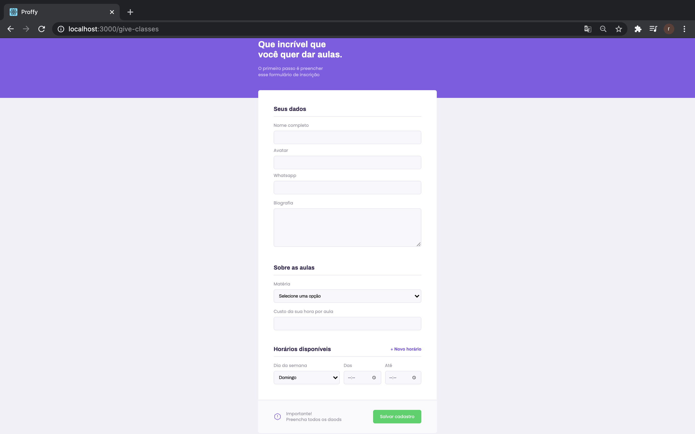
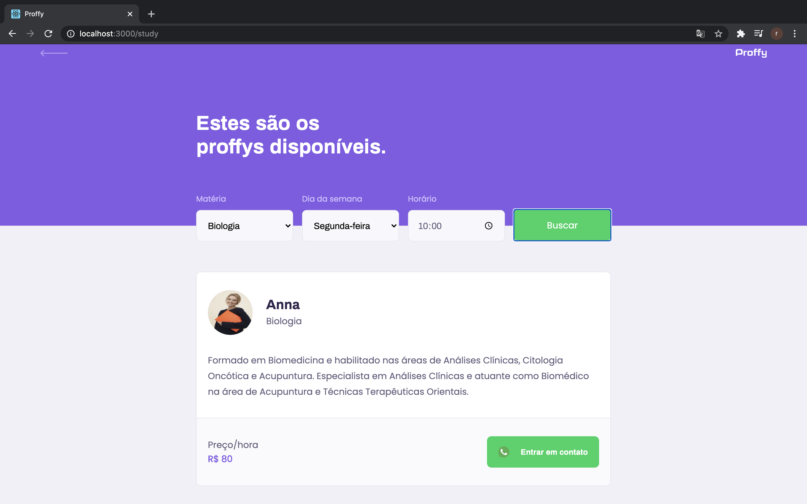

<p align="center">
  
</p>

<h3 align="center">
  Connecting professors with students! 🤓📝
</h3>

<br>

<p align="center">
  <a href="#Overview">Overview</a> •
  <a href="#Screenshots">Screenshots</a> •
  <a href="#Getting-Started">Getting Started</a> •
  <a href="#Technologies">Technologies</a> •
  <a href="#License">License</a> 
</p>

## 💻 Overview
The main goal of Proffy is to connect students with professors. In this application, they will be able to share, learn, and teach.

Project was developed during the Next Level Week #2 offered by [Rocketseat](https://rocketseat.com.br/). In this week, we learn more about web development in a practical way.

## 📸 Screenshots

### 🖥 Web
- Landing Page
    
- Creating your profile
    
- Looking for a professor
    

### 📱 Mobile
- Landing Page
    
- Creating your profile
    
- Looking for a professor
    
- Your favorite professor
    

## 📥 Getting Started
<p>
Before you start the project, you need to install:

- [NodeJs](https://nodejs.org/)
- [Yarn](https://yarnpkg.com/)
- [Expo](https://expo.io/)
</p>

```bash 
#Clone the repository
$ git clone https://github.com/rKayoo/proffy.git
```

### 🖲 Run API
```bash
# Acess the server's folder
$ cd proffy/server

# Install the dependencies
$ yarn install

# Run Application
$ yarn start
```
Access API: http://localhost:3333/

### 🖥 Run Web Project
```bash
# Acess the web's folder
$ cd proffy/web

# Install the dependencies
$ yarn install

# Run Application
$ yarn start
```

Access web project: http://localhost:3000/

### 📱 Run Mobile Project
To run the mobile project, you need to use [Expo](https://expo.io/). Use a cellphone with Expo installed or an IOS/Android.
```bash
# Acess the web's folder
$ cd proffy/mobile

# Install the dependencies
$ yarn install

# Run Application
$ yarn start
```

## 🛠 Technologies
The project used the following technologies: 
- [NodeJS](https://nodejs.org/)
- [Typescript](https://www.typescriptlang.org/)
- [React](https://reactjs.org/)
- [React Native](https://reactnative.dev/)
- [Expo](https://expo.io/)

## 📝 LICENSE
This project is licensed under the MIT License - see the [LICENSE.md]() file for details